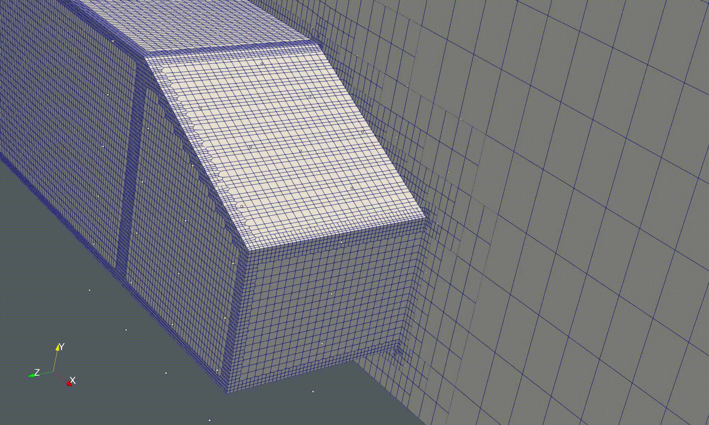

# Ahmed body DAFoam optimization
Drag optimisation of Ahmed Body with the DAFoam package



## Geometry Files


## Quick Start
```bash
# 1. Clone repository


# 3. Generate mesh

./preProcessing.sh

# 4. Start docker for DAFoam
docker run -it --rm -u dafoamuser --mount "type=bind,src=$(pwd),target=/home/dafoamuser/mount" -w /home/dafoamuser/mount dafoam/opt-packages:v4.0.3 bash

# 5. Create free-form deformation points
python3 FFD/genFFD.py
# Can use convert_ffd_to_vtk.py to generate a file which can be viewed in paraview (sanity check)

# 6. Run simulation
mpirun -np 32 python runScript.py 2>&1 | tee logOpt.txt


## Case Details
- Solver: DAsimpleFoam (steady-state RANS)
- Turbulence: k-omega SST
- Mesher: snappyHexMesh
- Domain: 75m × 6m × 5m wind tunnel (symmetry across centreline of car)

